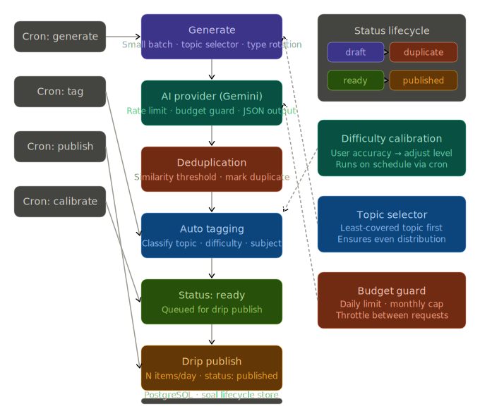

This article explains how we designed an AI-powered question generator system for UTBK preparation with a strict focus on keeping operational cost near zero. The system relies on Google Gemini 2.5 Flash as the primary model, but the real cost efficiency comes from workflow design: controlled batching, throttling, deduplication, lifecycle-based content management, and drip publishing. Rather than optimizing for maximum AI usage, we optimize for sustainable daily generation within free-tier constraints while keeping the system aligned with the mission of providing accessible education through [terasbelajarasik.web.id/bank-soal](https://terasbelajarasik.web.id/bank-soal).

---

## 1. The Real Constraint: AI Is Not the Product, the Workflow Is

When building an AI question generator system, it is easy to assume that the main challenge is choosing the right model.

In reality, the model is not the problem.

The real constraint is:

> How to design a system where AI becomes a controlled utility, not an uncontrolled cost driver.

Without proper architecture, AI systems tend to:

- generate redundant content
- repeat similar questions across runs
- waste tokens on formatting and validation
- scale cost unintentionally with usage
- rely too heavily on AI for deterministic tasks

At scale, this makes the system unpredictable and financially unsustainable.

So the goal is not “maximum generation,” but:

> **stable, controlled, and predictable daily content generation with minimal AI dependency.**

---

## 2. Model Choice: Why We Use Gemini 2.5 Flash

We use, specifically **Gemini 2.5 Flash**, as the core generation model.

The decision is not based on it being the “most powerful” model available, but because it fits three operational requirements:

### 1. Cost Efficiency

It can be used without attaching a paid billing layer in early-stage usage, which is critical for maintaining a near-zero cost system.

### 2. Latency and Throughput

It is fast enough for batch-based generation pipelines, which is more important than raw intelligence in this use case.

### 3. Sufficient Quality for Structured Content

For UTBK-style question generation, we do not require frontier-level reasoning. We require:

- structured output
- consistent formatting
- controllable randomness
- predictable difficulty scaling

Gemini 2.5 Flash is sufficient for this purpose.

More details about usage limits and behavior can be explored directly from official documentation:  
https://ai.google.dev/gemini-api/docs

---

## 3. High-Level System Architecture

The system is built as a **multi-stage controlled pipeline**, not a direct generation system.

---

## 4. Core Design Principles

### 4.1 Small Batch, Always

We intentionally avoid large-scale generation.

Each execution:

- generates a small batch of questions
- rotates between subject types
- ensures predictable API usage

This prevents:

- request spikes
- quota instability
- uncontrolled token bursts

---

### 4.2 Controlled Throttling Instead of Maximum Throughput

Instead of trying to maximize request speed, we enforce:

- spacing between requests
- sequential execution flow
- no parallel AI bursts

The goal is not speed, but stability.

---

### 4.3 Strict Output Structure (No Free-Form AI Output)

Every response must follow a strict JSON structure.

If the output is invalid:

- it is rejected
- optionally retried in the next cycle
- never manually corrected using another AI call

This eliminates:

- secondary AI validation calls
- parsing overhead
- regeneration loops caused by formatting issues

---

### 4.4 Auto Tagging with Limited Capacity

Tagging is handled separately from generation.

However:

- only a limited number of items are processed per run
- tagging is distributed across time

This prevents tagging from becoming a hidden cost multiplier.

---

### 4.5 Deduplication as a Cost Protection Layer

Before anything is published:

- all generated questions are compared against existing dataset
- similarity threshold is intentionally strict

If duplicate:

- marked as `duplicate`
- excluded from publishing pipeline
- no regeneration triggered immediately

This is one of the most important cost-saving mechanisms.

---

### 4.6 Difficulty Calibration from Real Usage

Instead of relying on AI to estimate difficulty repeatedly, we use:

- real user correctness rate
- response time distribution
- aggregated performance signals

This reduces unnecessary re-generation cycles.

---

### 4.7 Lifecycle-Based Content System

Every question moves through a controlled lifecycle:

- `draft` → generated content
- `ready` → validated and safe for use
- `published` → visible to users
- `duplicate` → excluded from system output

This ensures:

- no premature publishing
- no repeated AI processing
- clear separation between generation and production

---

### 4.8 Drip Publishing Strategy

Even after a question is ready:

- it is not published immediately
- it is released gradually

This stabilizes:

- system load
- user experience
- downstream processing demand

---

## 5. Working Within Gemini Usage Boundaries

We deliberately design the system to stay within safe usage behavior of Gemini 2.5 Flash free-tier operation.

Rather than focusing on exact numbers, we follow a simpler engineering approach:

> We design for **low-frequency, predictable, and evenly distributed requests**, instead of trying to maximize throughput.

In practice, this means:

- no burst generation
- no parallel worker flooding
- no continuous AI loops
- strict batch-based execution

This aligns with how free-tier AI systems are intended to be used: steady, non-abusive workloads.

---

## 6. A Reality We Chose Not to Exploit

Technically, it is possible to scale request volume by:

- creating multiple API accounts
- distributing load across them
- rotating keys to increase throughput

Yes, that approach would allow higher generation frequency.

But we deliberately do not take that route.

Because:

- it violates the spirit of free-tier usage
- it introduces system fragility
- it creates operational complexity
- and most importantly, it is unnecessary for our goal

We are not building a high-frequency AI content farm.

We are building a sustainable educational system.

So instead of optimizing for maximum extraction, we optimize for **responsible usage**.

---

## 7. Why We Don’t Use “More Powerful” Models Like GPT

We also evaluated GPT-based systems, but the architecture differences are significant.

<!-- With :contentReference[oaicite:1]{index=1}: -->

- usage is inherently token-billed
- every request contributes directly to cost
- scaling automatically increases expenses
- there is no equivalent “free operational buffer”

This creates a fundamentally different system design constraint:

> GPT systems require cost-first engineering, while Gemini allows workflow-first engineering.

For our use case—educational content generation for students with limited financial access—this distinction is critical.

---

## 8. Alignment With Our Mission

The entire system exists to support [terasbelajarasik.web.id](https://terasbelajarasik.web.id).

<!-- 👉 :contentReference[oaicite:2]{index=2} -->

Our goal is simple:

- help students prepare for UTBK
- without requiring expensive paid courses
- without introducing subscription barriers

That is why:

- AI cost must remain near zero
- infrastructure must be sustainable
- system complexity must serve affordability, not scale-for-profit

This is not a high-end AI product.

It is an accessibility-driven educational tool.

---

## 9. Key Takeaway

The most important lesson from building this system is:

> AI cost control is not achieved by limiting usage alone, but by designing workflows that naturally prevent unnecessary usage.

By combining:

- small batch generation
- strict lifecycle control
- deduplication-first architecture
- throttled execution
- quota-aware design using Gemini 2.5 Flash

we ensure the system remains stable, predictable, and financially sustainable.

---

## 10. Implementation Checklist (Business-Focused)

- [ ] Design AI usage as part of a controlled workflow, not direct generation calls
- [ ] Use small batch generation per scheduled cycle
- [ ] Avoid burst or parallel AI requests
- [ ] Introduce lifecycle stages for all generated content
- [ ] Implement strict deduplication before publishing
- [ ] Limit AI usage for auxiliary tasks like tagging
- [ ] Distribute generation over time instead of maximizing throughput
- [ ] Prefer steady request patterns over high-frequency execution
- [ ] Avoid scaling AI usage through multiple accounts or keys
- [ ] Align system design with educational accessibility goals
- [ ] Ensure AI usage supports business mission, not just technical optimization

---

## Final Thoughts

Could we just scale this system by adding more AI accounts or moving everything to a paid GPT-based API? Technically, yes. It would be faster, simpler in some parts, and much more straightforward from an engineering perspective.

But that’s not the point of what we’re building.

There’s something more intentional about designing within constraints—especially when the goal is to build an education platform like [terasbelajarasik.web.id](https://terasbelajarasik.web.id). Every decision becomes more deliberate: how often we generate questions, how we structure batches, when we allow AI to be called, and when we explicitly decide not to use it at all.

Working with Gemini 2.5 Flash in a controlled, free-tier-first architecture forces a different kind of engineering mindset. You stop thinking in terms of “how do we scale usage” and start thinking in terms of “how do we prevent unnecessary usage from happening in the first place.”

Even things like deduplication, lifecycle states, and drip publishing stop being just technical details—they become cost-control mechanisms that define the entire system behavior.

Of course, we could push harder. We could parallelize requests, distribute workloads across multiple accounts, or try to extract more throughput from the system. But that would slowly shift the project away from its original intention: building something sustainable, not something maximally aggressive.

There’s a discipline in deliberately not doing the “obvious scaling tricks,” even when they are technically possible.

In the end, it feels less like building an AI system and more like designing a constrained production line where every AI call has to justify its existence.

And maybe that’s the real lesson here: the best system is not the one that uses AI the most—but the one that uses it only when everything else has already been done correctly.

_If you have questions about any part of this setup, feel free to reach out!_
