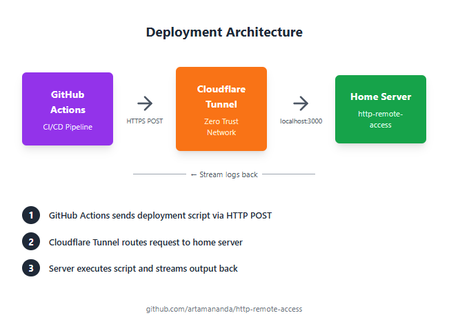

In my [previous post](link-to-previous-article), I shared how I run my own server using an Android TV box with Armbian and Cloudflare Zero Trust. While this setup works great for serving applications to the internet, I quickly ran into another challenge: **how do I deploy updates from GitHub Actions?**

---

## The Deployment Problem

Traditional deployment workflows rely on SSH access to push code and run commands on your server. Tools like `rsync`, `scp`, or GitHub Actions plugins like `appleboy/ssh-action` all assume you can directly SSH into your server.

But here's the catch: **my server doesn't have a public IP address.**

### Why SSH Deployment Doesn't Work

When your server is behind Cloudflare Zero Trust tunnels:

- There's **no direct SSH access** from the internet
- The tunnel only exposes HTTP/HTTPS endpoints
- Traditional `drone-scp` or SSH-based GitHub Actions can't reach your server
- You can't use standard deployment tools that rely on SSH

This left me stuck. How could I automate deployments when my CI/CD pipeline can't SSH into my server?

---

## The Solution: HTTP-Based Remote Access

After exploring various options, I decided to build my own solution: **a lightweight HTTP server that accepts deployment scripts and executes them remotely.**

I created [http-remote-access](https://github.com/artamananda/http-remote-access), a simple yet powerful tool that bridges the gap between GitHub Actions and your home server.

### How It Works

The concept is straightforward:

1. **Install the HTTP server** on your home server (the one behind Cloudflare tunnel)
2. **Expose the HTTP endpoint** through your Cloudflare tunnel
3. **Send deployment scripts** from GitHub Actions via HTTP POST requests
4. **Stream the output** back to GitHub Actions logs in real-time



---

## Setting Up HTTP Remote Access

### Step 1: Install on Your Server

First, install the `http-remote-access` server on your home server:

```bash
# Clone the repository
git clone https://github.com/artamananda/http-remote-access.git
cd http-remote-access

# Install dependencies (adjust based on your language/framework)
npm install

# Configure your server
cp .env.example .env
# Edit .env to set your authentication token
```

### Step 2: Configure Authentication

Security is crucial since this tool executes arbitrary commands. Set up a strong authentication token:

```env
# .env file
AUTH_TOKEN=your-super-secret-token-here
PORT=3000
```

### Step 3: Run the Server

Start the HTTP server:

```bash
# Using a process manager like PM2
pm2 start server.js --name deployment-server

# Or using systemd for auto-restart
sudo systemctl enable deployment-server
sudo systemctl start deployment-server
```

### Step 4: Expose via Cloudflare Tunnel

Add a new route in your Cloudflare Zero Trust dashboard:

```
Subdomain: deploy.yourdomain.com
Service: http://localhost:3000
```

Now your deployment endpoint is accessible at `https://deploy.yourdomain.com`

---

## Using It in GitHub Actions

Here's how to integrate this into your CI/CD pipeline:

### Basic Deployment Workflow

```yaml
name: Deploy to Home Server

on:
  push:
    branches: [main]

jobs:
  deploy:
    runs-on: ubuntu-latest

    steps:
      - name: Checkout code
        uses: actions/checkout@v3

      - name: Deploy to server
        env:
          DEPLOY_TOKEN: ${{ secrets.DEPLOY_TOKEN }}
          DEPLOY_URL: ${{ secrets.DEPLOY_URL }}
        run: |
          curl -X POST $DEPLOY_URL \
            -H "Authorization: Bearer $DEPLOY_TOKEN" \
            -H "Content-Type: application/json" \
            -d '{
              "script": "cd /var/www/myapp && git pull origin main && npm install && pm2 restart myapp"
            }'
```

### Advanced: Multi-Step Deployment with Output Streaming

```yaml
name: Advanced Deployment

on:
  push:
    branches: [main]

jobs:
  deploy:
    runs-on: ubuntu-latest

    steps:
      - name: Checkout code
        uses: actions/checkout@v3

      - name: Build application
        run: |
          npm install
          npm run build

      - name: Deploy to server
        env:
          DEPLOY_TOKEN: ${{ secrets.DEPLOY_TOKEN }}
          DEPLOY_URL: ${{ secrets.DEPLOY_URL }}
        run: |
          # Multi-line deployment script
          SCRIPT=$(cat <<'EOF'
          set -e
          echo "Starting deployment..."

          # Navigate to app directory
          cd /var/www/myapp

          # Pull latest changes
          echo "Pulling latest code..."
          git pull origin main

          # Install dependencies
          echo "Installing dependencies..."
          npm ci --production

          # Run database migrations
          echo "Running migrations..."
          npm run migrate

          # Restart application
          echo "Restarting application..."
          pm2 restart myapp

          echo "Deployment completed successfully!"
          EOF
          )

          # Send script to server
          curl -X POST $DEPLOY_URL \
            -H "Authorization: Bearer $DEPLOY_TOKEN" \
            -H "Content-Type: application/json" \
            -d "{\"script\": $(echo "$SCRIPT" | jq -Rs .)}"
```

---

## Key Features

### 1. Real-Time Output Streaming

The tool streams command output back to GitHub Actions in real-time. This means:

- You see logs as they happen
- Errors are immediately visible
- No waiting for the entire script to complete before seeing results

### 2. Error Handling

If a command fails, the HTTP response includes:

- Exit code
- Error output
- Stack trace (if applicable)

This makes debugging deployment issues straightforward.

### 3. Security Considerations

The tool implements several security measures:

- **Token-based authentication**: Only authorized requests can execute commands
- **HTTPS only**: All traffic goes through Cloudflare's encrypted tunnel
- **Command validation**: Optional whitelisting of allowed commands
- **Rate limiting**: Prevents abuse

### 4. Flexibility

You can deploy:

- Web applications
- Docker containers
- Database migrations
- Static sites
- Background services
- Any command-line workflow

---

## Example: Complete Deployment Setup

Here's a real-world example for a Node.js application:

### Server Setup (`/etc/systemd/system/deployment-server.service`)

```ini
[Unit]
Description=HTTP Deployment Server
After=network.target

[Service]
Type=simple
User=deploy
WorkingDirectory=/opt/http-remote-access
ExecStart=/usr/bin/node server.js
Restart=always
Environment=NODE_ENV=production

[Install]
WantedBy=multi-user.target
```

### GitHub Actions Workflow

```yaml
name: Deploy Production

on:
  push:
    branches: [main]
    paths:
      - 'src/**'
      - 'package.json'

jobs:
  test:
    runs-on: ubuntu-latest
    steps:
      - uses: actions/checkout@v3
      - name: Run tests
        run: |
          npm install
          npm test

  deploy:
    needs: test
    runs-on: ubuntu-latest
    steps:
      - name: Deploy to production
        env:
          DEPLOY_TOKEN: ${{ secrets.DEPLOY_TOKEN }}
          DEPLOY_URL: ${{ secrets.DEPLOY_URL }}
        run: |
          curl -X POST $DEPLOY_URL \
            -H "Authorization: Bearer $DEPLOY_TOKEN" \
            -H "Content-Type: application/json" \
            -d '{
              "script": "cd /var/www/myapp && git pull && npm ci && npm run build && pm2 reload myapp --update-env"
            }' \
            --fail \
            --silent \
            --show-error
```

---

## Advantages Over Traditional SSH Deployment

| Aspect                           | SSH-Based          | HTTP Remote Access    |
| -------------------------------- | ------------------ | --------------------- |
| **Requires Public IP**           | Yes                | No                    |
| **Works with Cloudflare Tunnel** | No                 | Yes                   |
| **Setup Complexity**             | High (keys, ports) | Low (single endpoint) |
| **Real-time Logs**               | Limited            | Full streaming        |
| **Firewall Friendly**            | Often blocked      | HTTPS always allowed  |
| **Authentication**               | SSH keys           | Bearer tokens         |

---

## Security Best Practices

When using this deployment method:

1. **Use strong tokens**: Generate cryptographically secure tokens
2. **Limit script scope**: Don't run as root; use a dedicated deployment user
3. **Enable HTTPS only**: Never expose the HTTP endpoint directly
4. **Implement rate limiting**: Prevent brute force attempts
5. **Audit logs**: Keep track of all deployment executions
6. **Use GitHub Secrets**: Never commit tokens to your repository

---

## Troubleshooting Common Issues

### Deployment script fails silently

**Solution**: Add `set -e` at the start of your script to exit on first error:

```bash
set -e
echo "This will stop if it fails"
```

### Can't see real-time output

**Solution**: Ensure your curl command doesn't buffer output:

```bash
curl -X POST $DEPLOY_URL --no-buffer ...
```

### Authentication errors

**Solution**: Verify your token matches on both ends:

```bash
# Test your token
curl -X POST $DEPLOY_URL \
  -H "Authorization: Bearer $DEPLOY_TOKEN" \
  -d '{"script": "echo test"}'
```

---

## Future Improvements

I'm planning to add:

- **Web UI** for manual deployments
- **Deployment history** and rollback capabilities
- **Multi-server support** for deploying to multiple instances
- **Webhook support** for other CI/CD platforms
- **Built-in secret management**

---

## Conclusion

Running a home server without a public IP doesn't mean you have to sacrifice modern deployment workflows. With `http-remote-access`, you can:

✅ Deploy from GitHub Actions seamlessly  
✅ See real-time logs and errors  
✅ Maintain security with token authentication  
✅ Avoid SSH complexity and firewall issues  
✅ Keep your automation simple and reliable

The tool is open source and available at [github.com/artamananda/http-remote-access](https://github.com/artamananda/http-remote-access). Feel free to contribute, report issues, or suggest improvements!

---

## Get Started

1. Clone the repository: `git clone https://github.com/artamananda/http-remote-access.git`
2. Follow the setup guide in the README
3. Configure your GitHub Actions workflow
4. Deploy with confidence!

---

_Have questions or suggestions? Feel free to reach out if you have any questions or feedback!_
